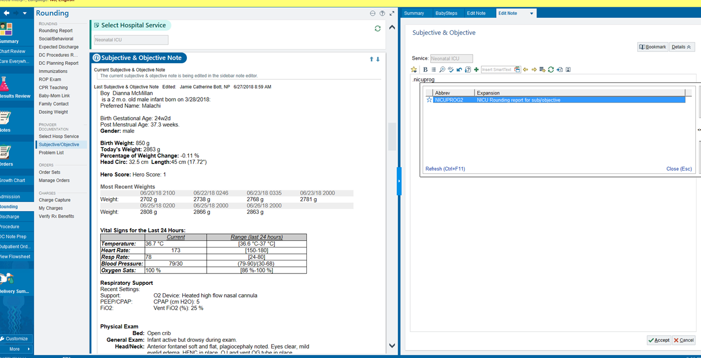

# Intro

## About me

| Yrs | Research activities                 | Clinical activities |
|-----|-------------------------------------|------------------------------|
| 3+1 | n/a                                 |  Internal medicine residency |
| 2+1 | MMSc biomedical informatics         | Outpatient urgent care |
| 4   | VA Boston: Clinical trials           | Hospitalist |
| 5   | BCM & VA Houston: Health services research | Hospitalist |

What is *Clinical research informatics?*

- I make various clinical research studies "go," using existing data.
- "Phenotyping" using electronic health record (EHR) data

## A detailed reference about secondary use[^MIT]

[^MIT]: MIT Critical Data. *Secondary Analysis of Electronic Health Records.*
Springer Cham, 2016. [Click for **free** access!](https://link.springer.com/book/10.1007/978-3-319-43742-2)

{ height=75% }

## Layers of data quality (where things can go wrong)

From "little picture" to big picture:

1. Data itself (contents) is flawed
    - occasional errors, typos, misunderstandings, *etc.*
    - low fidelity extraction
    - missing or highly missing
    - rampant errors or "practically lies"
2. Data need to be turned into *analytic dataset* (more later)
3. Data exist but are called 130 different things.
4. Data are called misleading things (names don't mean what clinicians think)
5. Data exist only in "free text"
    - Data can be auto-extracted but we must build that pipeline.
    - Data exist but need human judgment to extract.
6. Data you want aren't in here at all.

## What "data cleaning" means

If someone says "data cleaning," I recommend *having them explain* what they mean!

It's not "just filtering out obvious errors" like height = 6.1 inches.

It's not "throwing away outliers."

# When data contain errors

## Simple errors (what many people think "data cleaning" is)

::: columns
:::: column

::::
:::: column

::::
:::

## General references

Some authors[^weis] say 5 domains: completeness, correctness,
concordance, plausibility, and currency. Several literature
reviews,[^lit]

## Most recent systematic review

the most recent of which [^seven] says 7 domains.
However, no "standard approach for assessing EHR data quality", so
"Guidelines are needed for EHR data quality assessment\ldots."

- completeness, followed by
- correctness,
- concordance,
- plausibility, and
- currency.
- conformance
- bias

[^seven]: Lewis AE, Weiskopf N, Abrams ZB, et al. Electronic health record data quality assessment and tools: a systematic review. *J Am Med Inform Assoc.* 2023;30(10):1730--1740. [PMID: 37390812](https://pubmed.ncbi.nlm.nih.gov/37390812/)

## $3 \times 3$ Matrix[^three]

FIXME insert image

## Statistical MVP[^mvp]

- Prior work tries to "detect the implausible numbers using prespecified thresholds\ldots."

- domains: conformance, completeness, and plausibility

[^three]: Weiskopf NG, Bakken S, Hripcsak G, Weng C. A Data Quality
Assessment Guideline for Electronic Health Record Data Reuse. *EGEMS
(Wash DC).* 2017;5(1):14. [PMID: 29881734](https://pubmed.ncbi.nlm.nih.gov/29881734/)

[^lit]: Liaw ST, Guo JGN, Ansari S, et al. Quality assessment of real-world data repositories across the data life cycle: A literature review. *J Am Med Inform Assoc.* 2021;28(7):1591--1599. [PMID: 33496785](https://pubmed.ncbi.nlm.nih.gov/33496785/)

[^weis]: Weiskopf NG, Weng C. Methods and dimensions of electronic health record data quality assessment: enabling reuse for clinical research. *J Am Med Inform Assoc.* 2013;20(1):141--151. [PMID: 22733976](https://pubmed.ncbi.nlm.nih.gov/22733976/)

[^mvp]: Wang H, Belitskaya-Levy I, Wu F, *et al.* A statistical quality
assessment method for longitudinal observations in electronic health
record data with an application to the VA million veteran program.
*BMC Med Inform Decis Mak.* 2021;21(1):289. [PMID: 34670548](https://pubmed.ncbi.nlm.nih.gov/34670548/)

## Statistical mini-Sentinel

FIXME

## More approaches

refs from MM et al

## Missing data

- under-recognized
- potentially massive threat to validity
- there is no one right way, but several wrong ways
- usually "not my department," and detailed methods are out of scope.
- "patient goes out of network" is another form of it

## Fidelity

FIXME crop

## Fidelity

Matheny example of dates etc UTC

## Rampant errors

> If you don't understand the data generation process, you're gonna miss stuff.

---David Adams, PhD (Sr.\ software engineer at Verily). "Machine
Learning Isn’t Magic." HMS clinical informatics lecture series,
2018-04-24.

# Making an analytic dataset

## Definition

analytic dataset:
: insert definition here

Also known as "tidy."

Also known as "wide."

## What EHRs are really like

FIXME table names

## What to do with time series

many approaches.

what about derived things (BMI)

# Merging fragmented data

## Fillmore *et al.* lab data integration

# Unexpected data naming

## Example from BCM

`procedures` contains what?

# Extracting data from free text & beyond

## "Let's just do\ldots"

Notes have typos, nonstandard abbreviations, and incorrect
information, just like "structured" data.

Transcription errors. "Intrathecal DepoCyt" $\to$ "intrathecal etoposide"

## Ryu et al. auto extraction

FIXME

## Harder than people think

Labeling data is *expensive!* How did Google/Verily train a convolutional neural net to interpret retinal fundus photographs?[^gulshan]

$(3 \ldots 7) \times 128,000 + 8 \times 9963 + 7 \times 1748 =$

- 476,000 to 989,000 retinal imaging reads

## Cost of labeling data

- 476,000 to 989,000 retinal imaging reads
- A random article I found[^ijta] says 44 reads / hour
- 11k to 22k person-hours
- 5--11 *working years*
- 1.4--2.8 **million dollars!** (Before you do any computing at all)

That is *just* to score images on "referable" diabetic retinopathy. No other features of retina whatsoever.

[^ijta]: Kolomeyer *et al. International Journal of Telemedicine and Applications* 2012.

[^gulshan]: Gulshan *et al. JAMA* 2016.

## When data aren't in there

- just taking the medication
- income. don't assume ZIP does it for you.

# Conclusions

## Reusing EHR data is not what you may think\ldots

- Data are entered in "funny ways."
    - Well-meaning people enter the wrong number.
    - People "just click through" because they're busy.
    - It's surprisingly hard to "prove" the numbers are wrong.
    - Medical testing is *extremely* non-random!
- Just because the table is named `procedures` doesn't mean\ldots
- "Reshaping" data is a lot of work.
- The data may be "in there" but hard to get.
- The data may not be "in there" at all (system was not designed for it).

\ldots and yet, people manage to use EHR data for research!

### If you never tried swimming, don't jump in the deep end without a lifeguard.

## Thank you!

### Contact me or review materials:

- zimolzak@bcm.edu

- Source for this talk (make corrections/suggestions)--- <https://github.com/zimolzak/healthcare-data-quality>

- This work © 2024 by Andrew Zimolzak is licensed under CC BY-NC-SA 4.0, [click for license details](https://creativecommons.org/licenses/by-nc-sa/4.0/)
