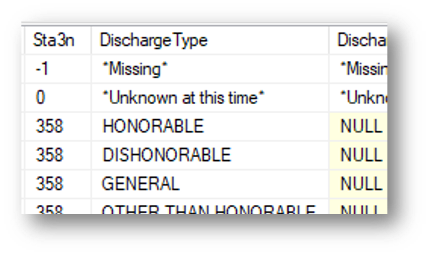

# Intro

## About me

| Yrs | Research activities                 | Clinical activities |
|-----|-------------------------------------|------------------------------|
| 3+1 | n/a                                 |  Internal medicine residency |
| 2+1 | MMSc biomedical informatics         | Outpatient urgent care |
| 4   | VA Boston: Clinical trials           | Hospitalist |
| 5   | BCM & VA Houston: Health services research | Hospitalist |

What is *Clinical research informatics?*

- I make various clinical research studies "go," using existing data.
- "Phenotyping" using electronic health record **(EHR)** data

## A detailed reference about secondary use[^MIT]

[^MIT]: MIT Critical Data. *Secondary Analysis of Electronic Health Records.*
Springer; 2016. [Click for **free** access!](https://link.springer.com/book/10.1007/978-3-319-43742-2)

{ height=75% }

## Layers of data quality (where things can go wrong)

From "little picture" to big picture:

1. Data itself (contents) is flawed
    - occasional errors, typos, misunderstandings, *etc.*
    - low fidelity extraction
    - missing or highly missing
    - rampant errors or "practically lies"
2. Data exist but are called 130 different things.
3. Data fields are called misleading things (names don't mean what clinicians think)
4. Data exist only in "free text"
    - Data can be auto-extracted but we must build that pipeline.
    - Data exist but need human judgment to extract.
5. Data you want aren't in here at all.

## What "data cleaning" means

If someone says "data cleaning," I recommend *having them explain* what they mean!

It's not "just filtering out obvious errors" like height = 6.1 inches.

It's not "throwing away outliers."

# Data quality frameworks

## Simple errors (what many people think "data cleaning" is)

::: columns
:::: column

::::
:::: column

::::
:::

## Data quality frameworks: General references

Early frameworks[^weis] described five domains of data quality: completeness, correctness,
concordance, plausibility, and currency.

There are several literature
reviews.[^lit]

[^lit]: Liaw ST, Guo JGN, Ansari S, *et al.* Quality assessment of real-world data repositories across the data life cycle: A literature review. *J Am Med Inform Assoc.* 2021;28(7):1591--1599. [PMID: 33496785](https://pubmed.ncbi.nlm.nih.gov/33496785/)

[^weis]: Weiskopf NG, Weng C. Methods and dimensions of electronic health record data quality assessment: enabling reuse for clinical research. *J Am Med Inform Assoc.* 2013;20(1):141--151. [PMID: 22733976](https://pubmed.ncbi.nlm.nih.gov/22733976/)

## Most recent systematic review

A more recent systematic review[^seven] now describes 7 domains.
However, the authors observe that there is no "standard approach for assessing EHR data quality", so
"guidelines are needed for EHR data quality assessment\ldots."

- Completeness
- Correctness
- Concordance
- Plausibility
- Currency
- Conformance
- Bias

[^seven]: Lewis AE, Weiskopf N, Abrams ZB, *et al.* Electronic health record data quality assessment and tools: a systematic review. *J Am Med Inform Assoc.* 2023;30(10):1730--1740. [PMID: 37390812](https://pubmed.ncbi.nlm.nih.gov/37390812/)

## More approaches

Three categories of data quality described in a 2016 paper: conformance, completeness,
plausibility.[^kahn] And five categories in a 2018 paper: accuracy, completeness,
consistency, credibility, and timeliness.[^feder] The latter paper also describes a straightforward list of "Approaches for quality appraisal:"

- Data validation with data rules
- Verification of abstraction with statistical measures
- Data comparisons with manual chart review
- Management of missing data using statistical methods
- Data triangulation between multiple EHR databases

[^feder]: Feder SL. Data Quality in Electronic Health Records Research: Quality Domains and Assessment Methods. *West J Nurs Res.* 2018;40(5):753--766. [PMID: 28322657](https://pubmed.ncbi.nlm.nih.gov/28322657/)

[^kahn]: Kahn MG, Callahan TJ, Barnard J, *et al.* A Harmonized Data Quality Assessment Terminology and Framework for the Secondary Use of Electronic Health Record Data. *EGEMS (Wash DC).* 2016;4(1):1244. [PMID: 27713905](https://pubmed.ncbi.nlm.nih.gov/27713905/)

## Summary of domains of data quality

Author $\to$      Lewis23    Weis13   Kahn16   Feder18         Wang21
--------          ----       ----     ----     ----            ----
**Completeness**  +          +        +        +               +
Correctness       +          +                 +
Concordance       +          +                 "consistency"
**Plausibility**  +          +        +        "credibility"   +
Currency          +          +                 +
Conformance       +                   +                        +
Bias              +

**Completeness and plausibility seem to be everyone's favorites!**

# Data quality, advanced

## One approach (Mini-Sentinel)[^mini]

### It was harder than they expected to "just merge labs" from data partners.

LOINC is a code that is supposed to take care of this, but\ldots

> [S]ome data partners found LOINC associated with essentially all
> results, others had LOINC associated with some results, and others
> found **no LOINC in source data.**

### How they follow data quality (sounds like "manually"):

> Checks included assessment of variable completeness, consistency,
> content, alignment with specifications, patterns, and trends. Data
> distributions are **examined** over time within and between [data]
> refreshes

[^mini]: Raebel MA, Haynes K, Woodworth TS, *et al.* Electronic clinical laboratory test results data tables: lessons from Mini-Sentinel. *Pharmacoepidemiol Drug Saf.* 2014;23(6):609--618. [PMID: 24677577](https://pubmed.ncbi.nlm.nih.gov/24677577/)

## When lab tests disappear/reappear (Mini-Sentinel)

::: columns
:::: column
{ height=75% }
::::
:::: column
- Number of INR lab tests suddenly dropped $18,000 \to 15,000$ one year. (System started storing as plain text.)

- Then suddenly $18,000 \to 24,000$ a few years later. (Clinic started importing data from hospital.)
::::
:::

## A bit of a mess (Mini-Sentinel)

{height=90%}

## Statistical approach to data quality in Million Veteran Program[^mvp]

- Prior work tries to "detect the implausible numbers using prespecified thresholds\ldots."

- Domains: conformance, completeness, and plausibility

- Improved plausibility score by testing height and weight correlation
  with past values *for that patient.* Exponentially weighted moving
  average.

- This approach had fewer false positives, higher power, higher
  positive and negative predictive value, compared to the "population
  threshold" approach.

[^mvp]: Wang H, Belitskaya-Levy I, Wu F, *et al.* A statistical quality
assessment method for longitudinal observations in electronic health
record data with an application to the VA million veteran program.
*BMC Med Inform Decis Mak.* 2021;21(1):289. [PMID: 34670548](https://pubmed.ncbi.nlm.nih.gov/34670548/)

## Missing data

- Under-recognized. (Tests get checked for a reason, and more frequently for sick patients.)
- Potentially massive threat to validity.
- There is no one right way to handle missing data, but several wrong ways.
- Detailed methods are out of scope for this talk.
- "Patient goes out of network" is another form of it (also sometimes under-appreciated).

## Fidelity: Rich text note example

{ height=75% }

## Fidelity: Rich text note example 2

## Fidelity: How you receive the note (almost no separators!)

`Discharge Physician: Zzzz, MD Discharge Diagnosis: 1. Chest pain, resolved 2. Hypotension, resolved 3. ESRD on HD Patient Active Problem List Diagnosis Date Noted • Respiratory insufficiency xx/20xx • Septic shock (HCC) xx/20xx • Community acquired bacterial pneumonia xx/20xx Flowsheet Rows Flowsheet Row Most Recent Value Malnutrition Evaluation Does not meet criteria for protein-calorie malnutrition Discharge Vitals: Vitals: xx/20xx BP: Pulse: 100 Resp: 18 Temp: SpO2: 99% Discharge Labs: Lab Results Component Value Date WBC 6.0 xx/20xx HGB 8.8 (L) xx/20xx HCT 25.4 (L) xx/20xx MCV 92 xx/20xx PLT 181 xx/20xx Lab Results Component Value Date GLUCOSE 85 xx/20xx CALCIUM 9.8 xx/20xx NA 133 (L) xx/20xx K 4.0 xx/20xx CO2 23 xx/20xx CL 95 (L) xx/20xx BUN 54 (H) xx/20xx CREATININE 13.0 (H) xx/20xx Discharged Condition: fair Consults: Treatment Team: Consulting Physician: Zzzz, MD Consulting Physician: Zzzz, MD`

## Fidelity: Why does one clinic look like patients stay > 1 day?

|Patient    | Clinic arrival |  Site  | Clinic checkout|
|-----------|----------------|--------|---------|
|Scott      | 2023-03-04     | Houston       | 2023-03-04 |
|Ryan	    | 2023-04-29     | Houston       | 2023-04-29 |
|Knepper    | 2023-05-11     | Houston       | 2023-05-11 |
|Hatcher    | 2023-09-15     | Houston       | 2023-09-15 |
|Lanier     | 2023-10-05     | Houston       | 2023-10-05 |
|
|Strawberry | 2023-02-18     | New York       | **2023-02-19** |
|Gooden     | 2023-03-12     | New York       | **2023-03-13** |
|Hernandez  | 2023-04-01     | New York       | **2023-04-02** |
|Ojeda	    | 2023-06-22     | New York       | **2023-06-23** |

## Both clinics put midnight local time as "checkout," but one reports it in a different time zone(!) [^mat]

|Patient    | Clinic arrival |  Site  | Clinic checkout|
|-----------|----------------|--------|---------|
|Scott      | 2023-03-04 11:01 CST   | Houston       | 2023-03-04 **23:59** CST |
|Ryan	    | 2023-04-29 13:40 CDT   | Houston       | 2023-04-29 **23:59** CDT |
|Knepper    | 2023-05-11 10:20 CDT   | Houston       | 2023-05-11 **23:59** CDT |
|Hatcher    | 2023-09-15 09:32 CDT   | Houston       | 2023-09-15 **23:59** CDT  |
|Lanier     | 2023-10-05 12:20 CDT   | Houston       | 2023-10-05 **23:59** CDT  |
|
|Strawberry | 2023-02-18 16:44 UTC   | New York       | **2023-02-19** 04:59 UTC |
|Gooden     | 2023-03-01 17:15 UTC   | New York       | **2023-03-13** 04:59 UTC |
|Hernandez  | 2023-04-01 13:33 UTC   | New York       | **2023-04-02** 03:59 UTC |
|Ojeda	    | 2023-06-22 18:09 UTC   | New York       | **2023-06-23** 03:59 UTC |

[^mat]: Matheny M, LeNoue-Newton M. A Comparison of Encounter Data Between VistA/CPRS & the Federal Electronic Health Record (EHR) Systems. *VA HSR Cyberseminar.* 2024-05-22. https://www.hsrd.research.va.gov/cyberseminars/

## "Rampant" errors

> If you don't understand the data generation process, you're gonna miss stuff.

---David Adams, PhD (Sr.\ software engineer at Verily). "Machine
Learning Isn’t Magic." HMS clinical informatics lecture series,
2018-04-24.

{height=40%}

# Merging fragmented data

## Data integration or harmonization: manual or automated[^nate]

{ height=75% }

[^nate]: Fillmore N, Do N, Brophy M, Zimolzak A. Interactive Machine Learning for Laboratory Data Integration. *Stud Health Technol Inform.* 2019;264:133--137. [PMID: 31437900](https://pubmed.ncbi.nlm.nih.gov/31437900/)

## Unexpected data naming: I just wanted to find ER discharge against medical advice\ldots

{width=200px} {width=200}\

{width=300px}

# Extracting data from free text & beyond

## "Let's just do\ldots"

### Don't assume natural language processing will go according to plan!

- Humans are maddeningly creative at expressing the same concept with many different phrasings.

- Notes have typos, nonstandard abbreviations, and incorrect
information, just like "structured" data.

- Not typos but transcription (or other) errors, nearly undetectable to untrained: "Intrathecal DepoCyt" $\to$ "Intrathecal etoposide"

## Automated information extraction from text[^ryu]

Rules-based and machine learning approaches work! But the problem was selected carefully.

{ height=60% }

[^ryu]: Ryu JH, Zimolzak AJ. Natural Language Processing of Serum Protein Electrophoresis Reports in the Veterans Affairs Health Care System. *JCO Clin Cancer Inform.* 2020;4:749--756. [PMID: 32813561](https://pubmed.ncbi.nlm.nih.gov/32813561/)

## Machine learning: harder than people think

Labeling data is *expensive!* How did Google/Verily train a convolutional neural net to interpret retinal fundus photographs?[^gulshan]

$(3 \ldots 7) \times 128,000 + 8 \times 9963 + 7 \times 1748 =$

**476,000 to 989,000** retinal imaging reads

## Estimated cost of labeling data (Gulshan *et al.*)

- 476,000 to 989,000 retinal imaging reads
- A random article I found[^ijta] says 44 reads / hour
- 11k to 22k person-hours
- 5--11 *working years*
- 1.4--2.8 **million dollars!** (Before you do any computing at all)

That is *just* to score images for "referable" diabetic retinopathy. The AI can assess no other features of the retina whatsoever.

[^ijta]: Kolomeyer AM, Nayak NV, Szirth BC, Khouri AS. Fundus autofluorescence imaging in an ocular screening program. *Int J Telemed Appl.* 2012;2012:806464. [PMID: 23316224](https://pubmed.ncbi.nlm.nih.gov/23316224/)

[^gulshan]: Gulshan V, Peng L, Coram M, *et al.* Development and Validation of a Deep Learning Algorithm for Detection of Diabetic Retinopathy in Retinal Fundus Photographs. *JAMA.* 2016;316(22):2402--2410. [PMID: 27898976](https://pubmed.ncbi.nlm.nih.gov/27898976/)

## When data aren't in the medical record at all

You might know\ldots                   But you don't know\ldots
-----                                  -----
A medicine was prescribed.             Did the patient fill the prescription?
The patient filled the prescription.   How many days did the patient miss?
The patient's ZIP code.                This *individual* patient's income.

# Conclusions

## Reusing EHR data is not what you may think\ldots

- Data are entered in "funny ways."
    - Well-meaning people enter the wrong number.
    - People "just click through" because they're so busy.
    - It's surprisingly hard to "prove" some data are wrong.
    - Medical testing is *extremely* non-random!
- Just because the table is named `procedures` doesn't mean\ldots
- The data may be "in there" but hard to get.
- The data may not be "in there" at all (system was not designed for it).

\ldots and yet, people manage to use EHR data for research!

### If you never tried swimming, don't jump in the deep end without a lifeguard.

## Thank you!

### Contact me or review materials:

- zimolzak@bcm.edu

- Source for this talk (make corrections/suggestions)--- <https://github.com/zimolzak/healthcare-data-quality>

- This work © 2024 by Andrew Zimolzak is licensed under CC BY-NC-SA 4.0, [click for license details](https://creativecommons.org/licenses/by-nc-sa/4.0/)

- Cite using doi:10.5281/zenodo.11393189
