## Objectives

1. Identify existing data sources, available through Baylor
Information Technology, that can be used for research or quality
improvement, and identify methods to access the data.

2. Understand the general processes used to appraise data quality.

# Introduction

## About me

| Yrs | Research activities                 | Clinical activities |
|-----|-------------------------------------|------------------------------|
| 3+1 | n/a                                 |  Internal medicine residency |
| 2+1 | MMSc biomedical informatics         | Outpatient urgent care |
| 4   | VA Boston: Clinical trials           | Hospitalist |
| 5   | BCM & VA Houston: Health services research | Hospitalist |

What is **Clinical research informatics?**

- I make various clinical research studies "go," using existing data.
- "Phenotyping" using electronic health record **(EHR)** data

## A detailed reference about secondary use[^MIT]

[^MIT]: MIT Critical Data. *Secondary Analysis of Electronic Health Records.*
Springer; 2016. [**Click here** for free access!](https://link.springer.com/book/10.1007/978-3-319-43742-2)

{ height=75% }

## Layers of data quality (where things can go wrong)

From "little picture" to big picture:

1. Data itself (contents) is flawed
    - occasional errors, typos, misunderstandings, *etc.*
    - low fidelity extraction
    - missing or highly missing
    - rampant errors
2. Data exist but are called 130 different things.
3. Data fields are called misleading things (names don't mean what clinicians think)
4. Data exist only in "free text"
    - Data can be auto-extracted but we must build that pipeline.
    - Data exist but need human judgment to extract.
5. Data you want aren't in here at all.

## What "data cleaning" means

If someone says "data cleaning," I recommend *having them explain* what they mean!

It's not "just filtering out obvious errors" like height = 6.1 inches.

It's not "throwing away outliers."

# Data at BCM

## Overview

### Baylor Medicine

- FIXME

### Baylor St.\ Luke's

- FIXME

### Epic Cosmos

- FIXME

### Many other affiliates.

- FIXME

# Data quality frameworks

## Examples of entry errors (what many people think "data cleaning" is)

::: columns
:::: column
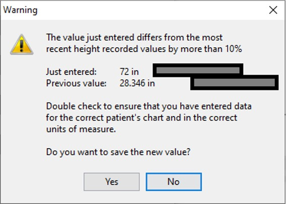
::::
:::: column
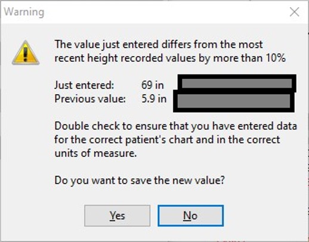
::::
:::

## Data quality domains

A systematic review that I like describes **seven domains** of data
quality.[^lewis] However, the authors observe that there is no
"standard approach for assessing EHR data quality", so "guidelines are
needed for EHR data quality assessment\ldots."

- Correctness
    - Concordance
    - Plausibility
- Completeness
    - Bias
- Conformance
- Currency

[^lewis]: Lewis AE, *et al.* Electronic health record data quality assessment and tools: a systematic review. *J Am Med Inform Assoc.* 2023;30(10):1730--1740. [PMID: 37390812](https://pubmed.ncbi.nlm.nih.gov/37390812/)

## Definitions 1--5

Correctness:

: The truthfulness of data in the EHR. (Also: accuracy, validity.)

Concordance:

: The agreement between elements within the EHR and between the EHR and other data sources. (Also: consistency, agreement.)

Plausibility:

: The extent to which EHR data make sense in a larger medical context. (Believable "in light of other knowledge" or possible "without asserting the correctness of the value.")

Completeness:

: The presence of data in the EHR. (Also: missingness, presence, availability.)

Bias:

: Missingness not at random. (*E.g.,* "sicker patients have higher levels of data completeness."[^lewis])

## Definitions 6--7

Conformance:

: Compliance with a predefined representational structure. (Agreement with "predefined structure, value, or format" and depends "on the usage of a correct data type and unit if necessary.")

Currency:

: The accuracy of the EHR data for the time at which it was recorded and how up to date the data are. "Timeliness."[^lewis]

## Summary of papers discussing domains of data quality

Author/yr. $\to$    **Lewis23**    Weiskopf13 Kahn16   Feder18         Wang21
--------            ----           ----       ----     ----            ----
Correctness         +              +                   +
\ Concordance       +              +                   "consistency"
\ **Plausibility**  +              +          +        "credibility"   +
**Completeness**    +              +          +        +               +
\ Bias              +
Conformance         +                         +                        +
Currency            +              +                   +

**Completeness and plausibility seem to be everyone's favorites**
across this table!

# Domains: Completeness, Bias

## When lab tests disappear/reappear (Mini-Sentinel)[^mini]

::: columns
:::: column
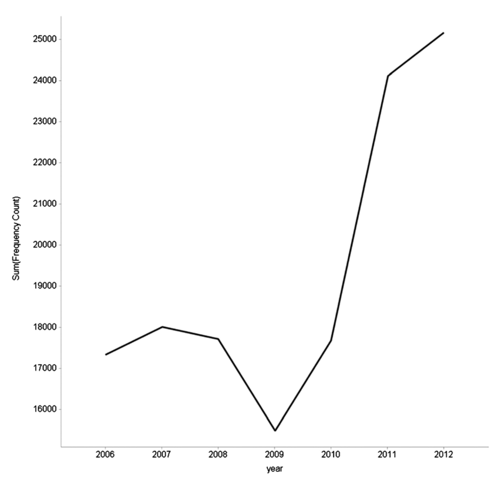{ height=75% }
::::
:::: column

- Number of INR lab tests suddenly $18,000 \to 15,000$ one
  year. Why? **The system was storing some results as plain text**
  (not numbers).

- Then suddenly $18,000 \to 24,000$ a few years later. Why? **Clinic
  started importing data from the hospital.**

- Lesson: Don't build the data-gathering system and walk away, assuming
  nothing will change.

::::
:::

[^mini]: Raebel MA, Haynes K, Woodworth TS, *et al.* Electronic clinical laboratory test results data tables: lessons from Mini-Sentinel. *Pharmacoepidemiol Drug Saf.* 2014;23(6):609--618. [PMID: 24677577](https://pubmed.ncbi.nlm.nih.gov/24677577/)

## Missing data in general (*Completeness* and *Bias*)

- This phenomenon is under-recognized. People think *missing data* means, "The lab measured the patient's serum sodium, but I can't access the result."

- But *missing* also means "not checked at all." Tests get checked for a reason, and **more frequently for sick patients** (only one example).  My serum sodium exists, but it was not measured on any day in 2024. Large gaps in time $\to$ "Was this an acute or slow change?"

- Potentially massive threat to validity.

- There is no one right way to handle missing data, but several wrong ways. Detailed methods are out of scope for this talk. Observational data are tricky. Epidemiology and statistics professionals are there for a reason.

**EHR data do not tell the whole story!**

## When data aren't in the medical record at all

You might know\ldots                   But you don't know\ldots
-----                                  -----
A medicine was prescribed.             Did the patient fill the prescription?
The patient filled the prescription.   How many days did the patient miss?
The patient's ZIP code.                This *individual* patient's income.

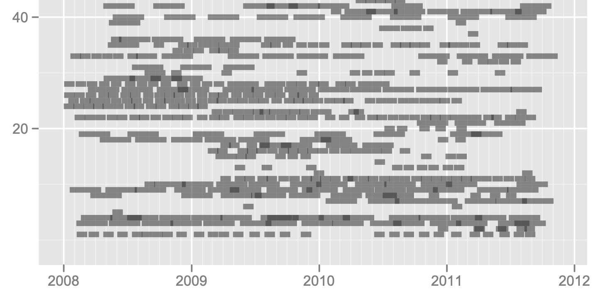{height=50%}

# Domain: Conformance

## One approach (Mini-Sentinel)[^mini]

### It was harder than they expected to "just merge labs" from data partners.

LOINC is a code that is supposed to take care of this, but\ldots

> [S]ome data partners found LOINC associated with essentially all
> results, others had LOINC associated with some results, and others
> found **no LOINC in source data.**

### How they follow data quality (sounds like "manually"):

> Checks included assessment of variable **completeness,** consistency,
> content, **alignment** with specifications, patterns, and trends. Data
> distributions are **examined** over time within and between [data]
> refreshes.

## Lab units (Mini-Sentinel): 12 data partners = 67 units!

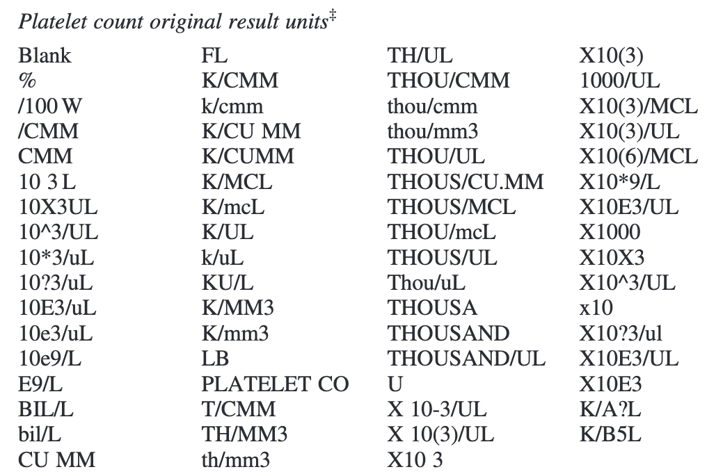{height=90%}

## Data "merging" or harmonization: manual or automated[^nate]

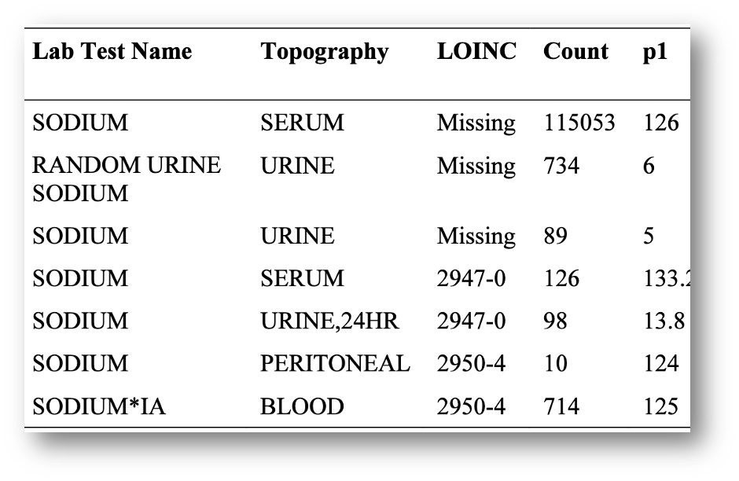{ height=75% }

[^nate]: Fillmore N, Do N, Brophy M, Zimolzak A. Interactive Machine Learning for Laboratory Data Integration. *Stud Health Technol Inform.* 2019;264:133--137. [PMID: 31437900](https://pubmed.ncbi.nlm.nih.gov/31437900/)

## Unexpected data naming: I just wanted to find ER discharge against medical advice\ldots

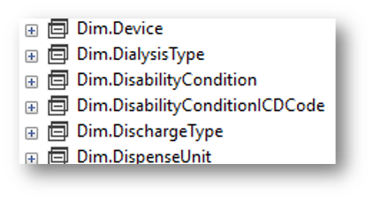{width=200px} 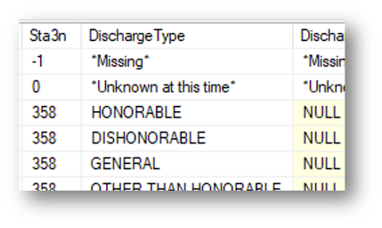{width=200}\

{width=300px}

# Domain: Plausibility

## Statistical approach to data quality in the Million Veteran Program[^mvp]

- Prior work tries to "detect the implausible numbers using prespecified thresholds\ldots." (Think of the 5.9 inch tall person.)

- This paper addressed 3 domains: conformance, completeness, and plausibility.

- Improved plausibility score by testing **height and weight
  correlation with past values for that patient.** Exponentially
  weighted moving average.

- This approach had fewer false positives, higher power, and higher
  positive and negative predictive value, compared to the "population
  threshold" approach.

[^mvp]: Wang H, Belitskaya-Levy I, Wu F, *et al.* A statistical quality
assessment method for longitudinal observations in electronic health
record data with an application to the VA million veteran program.
*BMC Med Inform Decis Mak.* 2021;21(1):289. [PMID: 34670548](https://pubmed.ncbi.nlm.nih.gov/34670548/)

# Domain: Correctness

## Example: Rich text note (not real names/dates)

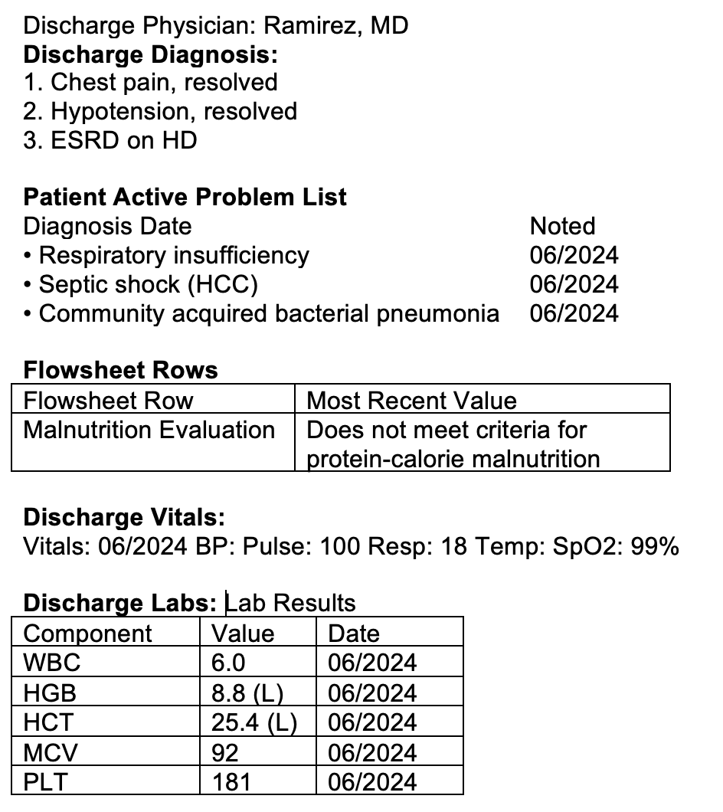{ height=90% }

## How you receive the note (formatting irretrievably lost)

`Discharge Physician: Ramirez, MD Discharge Diagnosis: 1. Chest pain, resolved 2. Hypotension, resolved 3. ESRD on HD Patient Active Problem List Diagnosis Date Noted • Respiratory insufficiency 06/2024 • Septic shock (HCC) 06/2024 • Community acquired bacterial pneumonia 06/2024 Flowsheet Rows Flowsheet Row Most Recent Value Malnutrition Evaluation Does not meet criteria for protein-calorie malnutrition Discharge Vitals: Vitals: 06/2024 BP: Pulse: 100 Resp: 18 Temp: SpO2: 99% Discharge Labs: Lab Results Component Value Date WBC 6.0 06/2024 HGB 8.8 (L) 06/2024 HCT 25.4 (L) 06/2024 MCV 92 06/2024 PLT 181 06/2024 Lab Results Component Value Date GLUCOSE 85 06/2024 CALCIUM 9.8 06/2024 NA 133 (L) 06/2024 K 4.0 06/2024 CO2 23 06/2024 CL 95 (L) 06/2024 BUN 54 (H) 06/2024 CREATININE 13.0 (H) 06/2024 Discharged Condition: fair Consults: Treatment Team: Consulting Physician: Swift, MD Consulting Physician: Seagraves, MD`

# Artificial intelligence for data quality?

## "Let's just do\ldots"

AI, machine learning, natural language processing, *etc.,* for
improving **completeness** by extracting data from text & images:

### Don't assume natural language processing will go according to plan!

- Humans are maddeningly creative at expressing the same concept with many different phrasings.

- Notes have typos, nonstandard abbreviations, and incorrect
information, just like "structured" data.

- Not typos but transcription (or other) errors, nearly undetectable to the untrained: "Intrathecal DepoCyt" $\to$ "Intrathecal etoposide"

## Automated information extraction from text[^ryu]

**Rules-based and machine learning approaches work!** But the problem was selected carefully.

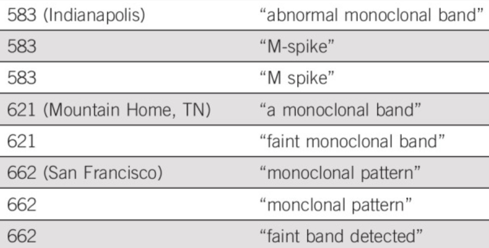{ height=60% }

[^ryu]: Ryu JH, Zimolzak AJ. Natural Language Processing of Serum Protein Electrophoresis Reports in the Veterans Affairs Health Care System. *JCO Clin Cancer Inform.* 2020;4:749--756. [PMID: 32813561](https://pubmed.ncbi.nlm.nih.gov/32813561/)

## Machine learning: harder than people think

Labeling data is *expensive!* How did Google/Verily train a convolutional neural net to interpret retinal fundus photographs?[^gulshan]

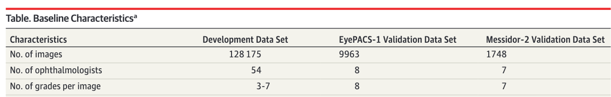

- **476,000 to 989,000** retinal imaging reads. Assume 44 reads / hour.[^ijta]

- That equals 5--11 *working years,* or **\$1.4--2.8
million!** (Before any computing at all. *Just* to score images for
"referable" diabetic retinopathy. The AI can assess no other features
of the retina whatsoever.)

[^ijta]: Kolomeyer AM *et al.* *Int J Telemed Appl.* 2012;2012:806464. [PMID: 23316224](https://pubmed.ncbi.nlm.nih.gov/23316224/)

[^gulshan]: Gulshan V, *et al.* *JAMA.* 2016;316(22):2402--2410. [PMID: 27898976](https://pubmed.ncbi.nlm.nih.gov/27898976/)

# Conclusion

## Reusing EHR data is not what you may think\ldots

### Correctness

- Well-meaning people enter the wrong number. (Plausibility, too)
- People "just click through" because they're so busy.
- It's surprisingly hard to "prove" some data right/wrong.

### Completeness

- Medical testing is *extremely* non-random!
- The data may not be "in there" at all (system was not designed for it).

### Conformance

- Just because the table is named `DischargeType` doesn't mean\ldots
- The data may be "in there" but hard to get.

### And yet\ldots

People manage to use EHR data for research! **If you never tried swimming, don't jump in the deep end without a lifeguard.**

## Thank you!

### Contact me or review materials:

- zimolzak@bcm.edu

- Source for this talk (make corrections/suggestions)--- <https://github.com/zimolzak/healthcare-data-quality>

- All PMIDs in slide references should work as hyperlinks.

- This work © 2024 by Andrew Zimolzak is licensed under CC BY-NC-SA 4.0. [Click for license details.](https://creativecommons.org/licenses/by-nc-sa/4.0/)

- Cite using [doi:10.5281/zenodo.11393189](https://zenodo.org/records/11393189)
