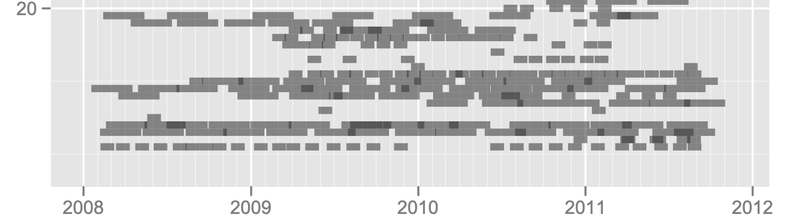

## Objectives

1. Identify existing data sources, available through Baylor
Information Technology, that can be used for research or quality
improvement, and identify methods to access the data.

2. Understand the general processes used to appraise data quality.

## About me

::: columns
:::: column
- Internal medicine residency
- MMSc biomedical informatics
- VA Boston: Clinical trials, hospitalist, urgent care
- BCM & VA Houston: Health services research & hospitalist

What is **Clinical research informatics?**

- I make various clinical research studies "go," using existing data.[^MIT]
- "Phenotyping" using electronic health record **(EHR)** data
::::
:::: column
{ height=75% }
::::
:::

[^MIT]: MIT Critical Data. *Secondary Analysis of Electronic Health Records.*
Springer; 2016. [**Click here** for free access!](https://link.springer.com/book/10.1007/978-3-319-43742-2)

# Data at BCM

## Internal BCM data

EHR data is **not the only way to do your Inquiry project!** Leave adequate time if requesting new data "from scratch," or match with a faculty investigator and get added to their protocol.

**it.bcm.edu** $\to$ sign in $\to$ Request a Service $\to$ Data/Reporting

### Baylor Medicine (formerly Baylor Clinic)

- *Outpatients,* including primary care, subspecialties (a few exceptions)
- Epic EHR system, starting 2009-02-01
- $\sim$ 4.6 million patients
- Working on a standard de-identified subset for students, researchers

### i2b2

- Quick access to numbers of patients, for feasibility (no identifiers)
- Access is through BCM IT

## External data (more or less)

### Epic Cosmos

- 214 million individuals (and growing)
- Hundreds/thousands of Epic organizations in the US contribute data
- Request access through BCM IT, but limited user "slots"

### Baylor St.\ Luke's Medical Center

- *Inpatients*
- Part of larger health network CommonSpirit
- They are "on Epic," but it's not the same Epic as Baylor Medicine.
- BCM IT *can* address data needs but don't "own" the data

### Many other affiliates (data access processes vary a lot)

- Baylor Scott & White Medical Center - Temple
- Harris Health (Ben Taub, LBJ): also Epic (#3)
- Veterans Affairs (Houston, Temple, 100+ others)
- Texas Children's Hospital: also Epic (#4)

# Data quality domains

## Data quality domains

EHR data quality assessment is much more than "fixing/excluding
obvious errors." A systematic review that I like describes **seven
domains** of data quality.[^Lewis]

- Correctness
    - Concordance
    - Plausibility
- Completeness
    - Bias
- Conformance
- Currency

However, the authors observe that there is no "standard approach for
assessing EHR data quality", so "guidelines are needed for EHR data
quality assessment\ldots."

[^Lewis]: Lewis AE, *et al.* Electronic health record data quality assessment and tools: a systematic review. *J Am Med Inform Assoc.* 2023;30(10):1730--1740. [PMID: 37390812](https://pubmed.ncbi.nlm.nih.gov/37390812/)

## Definitions 1--5 (the most common dimensions)

Correctness:

: The truthfulness of data in the EHR. (Also: accuracy, validity.)

Concordance:

: The agreement between elements within the EHR and between the EHR and other data sources. (Also: consistency, agreement.)

Plausibility:

: The extent to which EHR data make sense in a larger medical context. (Believable "in light of other knowledge" or possible "without asserting the correctness of the value.")

Completeness:

: The presence of data in the EHR. (Also: missingness, presence, availability.)

Bias:

: Missingness not at random. (*E.g.,* "sicker patients have higher levels of data completeness."[^Lewis])

## Definitions 6--7

Conformance:

: Compliance with a predefined representational structure. (Agreement with "predefined structure, value, or format" and depends "on the usage of a correct data type and unit if necessary.")

Currency:

: The accuracy of the EHR data for the time at which it was recorded and how up to date the data are. "Timeliness."[^Lewis]

# Domains: Completeness, Bias

## When lab tests disappear/reappear (Mini-Sentinel)[^mini]

::: columns
:::: column
{ height=75% }
::::
:::: column

- Number of INR lab tests suddenly $18,000 \to 15,000$ one
  year. Why? **The system was storing some results as plain text**
  (not numbers).

- Then suddenly $18,000 \to 24,000$ a few years later. Why? **Clinic
  started importing data from the hospital.**

- Lesson: Don't build the data-gathering system, assume that nothing
will change, and walk away forever.

::::
:::

[^mini]: Raebel MA, Haynes K, Woodworth TS, *et al.* Electronic clinical laboratory test results data tables: lessons from Mini-Sentinel. *Pharmacoepidemiol Drug Saf.* 2014;23(6):609--618. [PMID: 24677577](https://pubmed.ncbi.nlm.nih.gov/24677577/)

## When data aren't in the medical record at all

You might know\ldots                   But you don't know\ldots
-----                                  -----
A medicine was prescribed.             Did the patient fill the prescription?
The patient filled the prescription.   How many days did the patient miss?
The patient's ZIP code.                This *individual* patient's income.

{height=50%}

## Missing data in general: Bias

- This phenomenon is under-recognized. People think *missing data* means, "The lab measured the patient's serum sodium, but I can't access the result."

- But *missing* also means "not checked at all." One example: Tests get checked for a reason, and **more frequently for sick patients.**  My serum sodium exists, but it was not measured on any day in 2024. Large gaps in time $\to$ "Was this an acute or slow change?"

- Potentially massive threat to validity.

- There is no one right way to handle missing data, but several wrong ways. Detailed methods are out of scope for this talk. Observational data are tricky. Epidemiology and statistics professionals are there for a reason.

**EHR data do not tell the whole story!**

# Domain: Conformance

## Lab units (Mini-Sentinel): 12 data partners = 67 units!

{height=90%}

## Data "merging" or harmonization: manual or automated[^Nate]

{ height=75% }

[^Nate]: Fillmore N, Do N, Brophy M, Zimolzak A. Interactive Machine Learning for Laboratory Data Integration. *Stud Health Technol Inform.* 2019;264:133--137. [PMID: 31437900](https://pubmed.ncbi.nlm.nih.gov/31437900/)

# Domain: Plausibility

## Examples of simple entry errors (what many people think "data cleaning" is)

::: columns
:::: column

::::
:::: column

::::
:::

## Statistical approach to data quality in the Million Veteran Program[^MVP]

- Prior work tries to "detect the implausible numbers using prespecified thresholds\ldots." (Think of the 5.9 inch tall person.)

- This paper addressed 3 domains: conformance, completeness, and plausibility.

- Improved plausibility score by testing **height and weight
  correlation with past values for that patient.** Exponentially
  weighted moving average.

- This approach had fewer false positives, higher power, and higher
  positive and negative predictive value, compared to the "population
  threshold" approach.

[^MVP]: Wang H, Belitskaya-Levy I, Wu F, *et al.* A statistical quality
assessment method for longitudinal observations in electronic health
record data with an application to the VA million veteran program.
*BMC Med Inform Decis Mak.* 2021;21(1):289. [PMID: 34670548](https://pubmed.ncbi.nlm.nih.gov/34670548/)

# Domain: Correctness

## Example: Rich text note (not real names/dates)

{ height=90% }

## How you receive the note (formatting irretrievably lost)

`Discharge Physician: Ramirez, MD Discharge Diagnosis: 1. Chest pain, resolved 2. Hypotension, resolved 3. ESRD on HD Patient Active Problem List Diagnosis Date Noted • Respiratory insufficiency 06/2024 • Septic shock (HCC) 06/2024 • Community acquired bacterial pneumonia 06/2024 Flowsheet Rows Flowsheet Row Most Recent Value Malnutrition Evaluation Does not meet criteria for protein-calorie malnutrition Discharge Vitals: Vitals: 06/2024 BP: Pulse: 100 Resp: 18 Temp: SpO2: 99% Discharge Labs: Lab Results Component Value Date WBC 6.0 06/2024 HGB 8.8 (L) 06/2024 HCT 25.4 (L) 06/2024 MCV 92 06/2024 PLT 181 06/2024 Lab Results Component Value Date GLUCOSE 85 06/2024 CALCIUM 9.8 06/2024 NA 133 (L) 06/2024 K 4.0 06/2024 CO2 23 06/2024 CL 95 (L) 06/2024 BUN 54 (H) 06/2024 CREATININE 13.0 (H) 06/2024 Discharged Condition: fair Consults: Treatment Team: Consulting Physician: Swift, MD Consulting Physician: Seagraves, MD`

# Conclusion

## Reusing EHR data is not what you may think\ldots

### Completeness

- Medical testing is *extremely* non-random!
- The data may not be "in there" at all (system was not designed for it).

### Conformance

- Just because the table is named `DischargeType` doesn't mean\ldots
- The data may be "in there" but hard to get.

### Correctness

- Well-meaning people enter the wrong number. (Plausibility, too)
- People "just click through" because they're so busy.
- It's surprisingly hard to "prove" some data right/wrong.

### And yet\ldots

People still manage to use EHR data productively for research! **If you never tried swimming, don't jump in the deep end without a lifeguard.**

## Thank you!

### Contact me or review materials:

- zimolzak@bcm.edu

- Source for this talk (make corrections/suggestions)--- <https://github.com/zimolzak/healthcare-data-quality>

- All PMIDs in slide references should work as hyperlinks.

- This work © 2024 by Andrew Zimolzak is licensed under CC BY-NC-SA 4.0. [Click for license details.](https://creativecommons.org/licenses/by-nc-sa/4.0/)

- Cite using [doi:10.5281/zenodo.11393188](https://zenodo.org/records/11393188)
